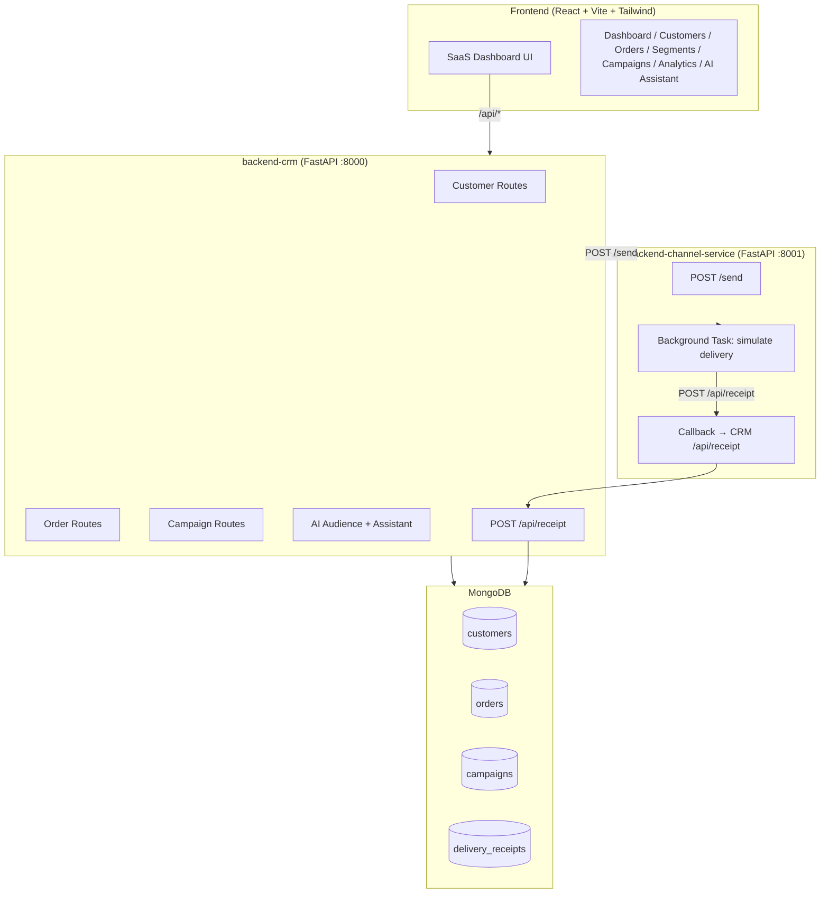

# AgentReach — AI-Native Mini CRM for Shopper Engagement

[](https://fastapi.tiangolo.com)
[](https://react.dev)
[](https://mongodb.com)
[](https://tailwindcss.com)

A production-ready AI-Native CRM platform with intelligent audience segmentation, multi-channel campaign management, and real-time delivery analytics.

## Architecture



## Project Structure

```
ai-powered-crm-platform/
├── frontend/                     # React + Vite + Tailwind CSS
│   └── src/
│       ├── api/                  # Axios API clients
│       ├── components/           # Shared UI components
│       └── pages/                # Dashboard, Customers, Orders, Segments, Campaigns, Analytics, AIAssistant
│
├── backend-crm/                  # Main CRM FastAPI (port 8000)
│   ├── app/
│   │   ├── core/                 # Database connection
│   │   ├── models/               # Pydantic models
│   │   ├── repositories/         # MongoDB data access
│   │   ├── routes/               # API routers
│   │   └── services/             # Business logic + AI service
│   ├── main.py
│   └── seed_data.py              # 100 customers + 500 orders
│
└── backend-channel-service/      # Channel microservice (port 8001)
    └── main.py
```

## Tech Stack

| Layer    | Technology              |
|----------|-------------------------|
| Frontend | React 19, Vite, Tailwind CSS 4, Recharts |
| Backend  | FastAPI 0.136, Python 3.11+ |
| Database | MongoDB 7.0, Motor (async driver) |
| HTTP Client | httpx (async) |
| Deployment | Vercel (frontend), Render (backend) |

## Getting Started

### Prerequisites
- Node.js 18+
- Python 3.11+
- MongoDB 6+ running locally or Atlas URI

### 1. Start MongoDB

```bash
# macOS with Homebrew
brew services start mongodb-community

# Or manual start
mkdir -p /tmp/mongodb-data
mongod --dbpath /tmp/mongodb-data --fork --logpath /tmp/mongodb.log
```

### 2. Backend CRM (port 8000)

```bash
cd backend-crm
python3 -m venv .venv
source .venv/bin/activate       # Windows: .venv\Scripts\activate
pip install -r requirements.txt
cp .env.example .env            # Edit if needed
python seed_data.py             # Load 100 customers + 500 orders
uvicorn main:app --host 0.0.0.0 --port 8000 --reload
```

### 3. Channel Service (port 8001)

```bash
cd backend-channel-service
python3 -m venv .venv
source .venv/bin/activate
pip install -r requirements.txt
uvicorn main:app --host 0.0.0.0 --port 8001 --reload
```

### 4. Frontend (port 5173)

```bash
cd frontend
npm install
npm run dev
```

Open http://localhost:5173

## API Documentation

| Service | URL |
|---------|-----|
| CRM API Docs | http://localhost:8000/docs |
| Channel Service Docs | http://localhost:8001/docs |

### Key CRM Endpoints

```
GET  /api/customers          — List customers (paginated)
POST /api/customers          — Add customer
GET  /api/customers/:id      — Customer detail + orders

GET  /api/orders             — List orders
POST /api/orders             — Create order
GET  /api/orders/stats/summary — Revenue stats

POST /api/ai/audience        — Build audience from natural language
POST /api/ai/assistant       — AI campaign suggestion

POST /api/campaigns          — Create and launch campaign
GET  /api/campaigns          — List campaigns
POST /api/receipt            — Delivery receipt callback

GET  /api/dashboard/stats    — Dashboard KPIs
```

### Channel Service Endpoint

```
POST /send
{
  "campaign_id": "CAMP-XXXXXXXX",
  "customer_id": "CUST-XXXXXXXX",
  "channel": "whatsapp|sms|email|rcs",
  "message": "Hi {name}!"
}
```

## AI Audience Builder

Supports natural language like:
- `"Customers who spent more than ₹5000"`
- `"Customers inactive for 45 days"`
- `"Customers from Chennai"`
- `"High value customers"`
- `"New customers in the last 30 days"`

## AI Campaign Assistant

Rule-based intents:
- **Reactivation** → inactive customers, WhatsApp, 15% OFF message
- **Upsell** → high-value, Email, VIP message
- **Onboarding** → new customers, Email, welcome offer
- **Promotion** → all customers, SMS, flash sale
- **Geo-targeting** → city-based, WhatsApp, local message

## Deployment

### Frontend → Vercel

```bash
cd frontend
npm run build
# Deploy /dist to Vercel
# Set env: VITE_API_URL=https://your-crm-api.onrender.com
```

### Backend CRM → Render

- Build command: `pip install -r requirements.txt`
- Start command: `uvicorn main:app --host 0.0.0.0 --port $PORT`
- Env vars: `MONGO_URI`, `DB_NAME`, `CHANNEL_SERVICE_URL`

### Channel Service → Render

- Start command: `uvicorn main:app --host 0.0.0.0 --port $PORT`
- Env vars: `CRM_RECEIPT_URL`

## MongoDB Schema

### customers
```json
{
  "customer_id": "CUST-XXXXXXXX",
  "name": "Aarav Sharma",
  "email": "aarav@example.com",
  "phone": "+91 9876543210",
  "city": "Mumbai",
  "joined_at": "2025-01-15T10:00:00Z"
}
```

### orders
```json
{
  "order_id": "ORD-XXXXXXXX",
  "customer_id": "CUST-XXXXXXXX",
  "amount": 2499.0,
  "items": [{"name": "Running Shoes", "quantity": 1, "price": 2499}],
  "created_at": "2025-06-01T14:30:00Z"
}
```

### campaigns
```json
{
  "campaign_id": "CAMP-XXXXXXXX",
  "name": "Summer Re-engagement",
  "audience_filter": {"total_spent": {"$gt": 5000}},
  "audience_description": "spent more than ₹5,000",
  "channel": "whatsapp",
  "message": "Hi {name}! We miss you...",
  "status": "active",
  "audience_count": 42,
  "created_at": "2026-06-10T20:00:00Z"
}
```

### delivery_receipts
```json
{
  "campaign_id": "CAMP-XXXXXXXX",
  "customer_id": "CUST-XXXXXXXX",
  "channel": "whatsapp",
  "status": "delivered|sent|failed|opened|read|clicked",
  "timestamp": "2026-06-10T20:01:00Z"
}
```
